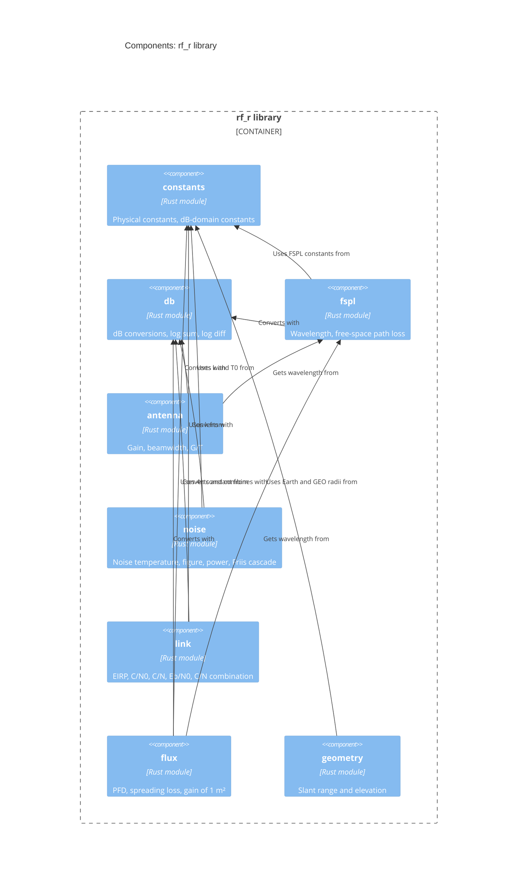

# C4 level 3: Components of the rf_r library

Each component is a module in `src/`. Arrows show which module uses which.

```mermaid
C4Component
  title Components: rf_r library
  Container_Boundary(lib, "rf_r library") {
    Component(constants, "constants", "Rust module", "Physical constants, dB-domain constants")
    Component(db, "db", "Rust module", "dB conversions, log sum, log diff")
    Component(fspl, "fspl", "Rust module", "Wavelength, free-space path loss")
    Component(antenna, "antenna", "Rust module", "Gain, beamwidth, G/T")
    Component(noise, "noise", "Rust module", "Noise temperature, figure, power, Friis cascade")
    Component(link, "link", "Rust module", "EIRP, C/N0, C/N, Eb/N0, C/N combination")
    Component(flux, "flux", "Rust module", "PFD, spreading loss, gain of 1 m²")
    Component(geometry, "geometry", "Rust module", "Slant range and elevation")
  }
  Rel(fspl, db, "Converts with")
  Rel(fspl, constants, "Uses FSPL constants from")
  Rel(antenna, fspl, "Gets wavelength from")
  Rel(antenna, db, "Converts with")
  Rel(noise, db, "Converts with")
  Rel(noise, constants, "Uses k and T0 from")
  Rel(link, db, "Converts and combines with")
  Rel(link, constants, "Uses k from")
  Rel(flux, fspl, "Gets wavelength from")
  Rel(flux, db, "Converts with")
  Rel(flux, constants, "Uses 4π constant from")
  Rel(geometry, constants, "Uses Earth and GEO radii from")
```

The `prelude` module re-exports all components and is not drawn.
